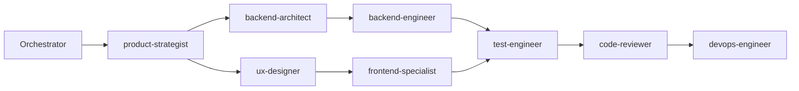
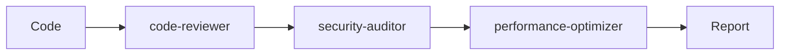

# Claude Code Unified Agents

A comprehensive collection of specialized Claude Code sub-agents combining the best features from multiple community repositories. This unified collection provides 82 production-ready agents across development, infrastructure, quality, AI/ML, business, creative, marketing, communication, meta-management, HR & agent management, Unreal Engine 5, and specialized domains.

## Features

- **82 Production-Ready Agents**: Comprehensive coverage across 12 categories
- **Smart Orchestration**: Master orchestrator for complex multi-agent workflows
- **Category Organization**: Agents organized by expertise domain for easy discovery
- **Deep Specialization**: Each agent includes production-ready code examples and implementation patterns
- **Flexible Tool Access**: Configurable tool permissions per agent
- **Best Practices**: Each agent follows industry best practices and patterns
- **Self-Improving**: HR agents audit, evaluate, and improve the agent collection
- **Meta-Management**: Advanced agents for context management, workflow optimization, and automation

## Agent Categories

### Development (17 agents)
- `backend-architect` - API design, microservices, database architecture
- `frontend-specialist` - React, Vue, Angular, modern UI frameworks
- `python-pro` - Advanced Python, async programming, optimization
- `fullstack-engineer` - End-to-end application development
- `mobile-developer` - iOS, Android, React Native, Flutter
- `blockchain-developer` - Smart contracts, Web3, DeFi
- `database-specialist` - SQL/NoSQL design, optimization, management
- `rust-pro` - Systems programming, memory safety, WebAssembly
- `golang-pro` - Concurrent programming, microservices, cloud-native
- `typescript-pro` - Advanced type systems, large-scale applications
- `javascript-pro` - Modern ES6+, async programming, Node.js
- `java-enterprise` - Spring Boot, microservices, JVM optimization
- `nextjs-pro` - Next.js 14+, App Router, React Server Components
- `react-pro` - Advanced hooks, performance, state management
- `vue-specialist` - Vue 3, Composition API, Nuxt 3, Pinia
- `angular-expert` - Angular 17+, signals, RxJS, enterprise apps
- `edge-serverless-developer` - Cloudflare Workers, AWS Lambda, Deno Deploy, edge computing

### Infrastructure (9 agents)
- `devops-engineer` - CI/CD, containerization, Kubernetes
- `cloud-architect` - AWS, GCP, Azure architecture and optimization
- `devsecops-engineer` - Security pipeline automation, SAST/SCA, container scanning, SBOM
- `iac-specialist` - Terraform, Pulumi, CloudFormation, drift detection, policy-as-code
- `incident-responder` - Production debugging, log analysis, recovery
- `performance-engineer` - Profiling, optimization, load testing
- `monitoring-specialist` - Observability, metrics, alerting
- `deployment-manager` - Release orchestration, rollback strategies
- `kubernetes-expert` - K8s configuration, helm charts, operators

### Quality (6 agents)
- `code-reviewer` - Code quality, security, best practices review
- `security-auditor` - Vulnerability assessment, penetration testing
- `test-engineer` - Test automation, strategies, frameworks
- `e2e-test-specialist` - Playwright, Cypress, test strategies
- `performance-tester` - Load testing, stress testing, benchmarking
- `accessibility-auditor` - WCAG compliance, screen reader testing

### Data & AI (7 agents)
- `ai-engineer` - LLMs, computer vision, NLP, ML systems
- `agentic-systems-engineer` - Multi-agent orchestration, tool registries, guardrails, evaluation
- `data-engineer` - ETL pipelines, data warehouses, big data
- `data-scientist` - Statistical analysis, ML models, visualization
- `mlops-engineer` - ML pipelines, experiment tracking, deployment
- `prompt-engineer` - LLM optimization, RAG systems, fine-tuning
- `analytics-engineer` - dbt, data modeling, BI tools

### Business & Process (6 agents)
- `project-manager` - Agile, sprint planning, coordination
- `product-strategist` - Market analysis, roadmapping, metrics
- `business-analyst` - Business process optimization, gap analysis, ROI calculations
- `technical-writer` - Human-authored documentation, information architecture, style guides
- `requirements-analyst` - Requirements engineering, user stories, traceability
- `api-designer` - OpenAPI/GraphQL specs, REST design, SDK generation

### Creative (7 agents)
- `ux-designer` - User experience, wireframing, design systems
- `ui-designer` - Visual design, OKLCH color systems, component specs
- `content-strategist` - Content strategy, editorial calendars, content audits
- `brand-designer` - Brand identity systems, token generation, style guides
- `design-system-engineer` - W3C design tokens, multi-platform transformation, visual regression
- `copywriter` - UX copy, tone analysis, readability scoring, A/B variants
- `motion-designer` - Animation systems, scroll-driven animations, performance budgets

### Marketing (7 agents)
- `seo-specialist` - Technical SEO audits, Core Web Vitals, schema markup, keyword strategy
- `email-marketer` - Email campaigns, deliverability, segmentation, automation flows
- `social-media-strategist` - Platform strategy, content calendars, engagement analytics
- `growth-engineer` - Experimentation frameworks, A/B testing, funnel optimization
- `content-marketer` - Content pipelines, distribution strategy, performance tracking
- `conversion-optimizer` - CRO audits, landing page optimization, multivariate testing
- `ad-specialist` - Paid media campaigns, bid strategy, ROAS optimization

### Communication (4 agents)
- `presentation-builder` - Slide decks, reveal.js, narrative structure, data visualization
- `team-communicator` - RFC documents, standup summaries, stakeholder updates
- `support-writer` - Knowledge base articles, troubleshooting guides, chatbot scripts
- `changelog-writer` - Release notes, semantic versioning, multi-audience changelogs

### HR & Agent Management (3 agents)
- `agent-performance-coach` - Agent quality evaluation, scoring rubrics, definition improvement
- `agent-gap-analyst` - Capability mapping, coverage gap detection, new agent specification
- `agent-talent-scout` - External agent discovery, candidate evaluation, format adaptation

### Meta-Management (5 agents)
- `context-manager` - Session continuity, memory optimization, distributed state
- `workflow-optimizer` - CI/CD optimization, build performance, pipeline efficiency
- `agent-generator` - Dynamic agent creation, DSL implementation, templates
- `error-detective` - Root cause analysis, stack trace forensics, pattern matching
- `documentation-writer` - Automated code docs, JSDoc/OpenAPI generation, coverage analysis

### Specialized Domains (5 agents)
- `game-developer` - Unity, Unreal Engine 5, Godot 4, procedural generation
- `embedded-engineer` - Arduino, Raspberry Pi, STM32, real-time systems
- `fintech-specialist` - Payment systems, PCI DSS compliance, fraud detection
- `healthcare-dev` - HIPAA/FHIR compliance, EHR systems, medical device integration
- `ecommerce-expert` - Shopping carts, checkout optimization, inventory management

### Unreal Engine 5 (6 agents)
- `ue5-blueprint-architect` - BP/C++ interfaces, data-driven design, Blueprint best practices
- `ue5-gameplay-programmer` - GAS, Enhanced Input, game framework architecture, subsystems
- `ue5-multiplayer-engineer` - Replication, RPCs, dedicated servers, EOS, networked movement
- `ue5-rendering-engineer` - Nanite, Lumen, VSM, World Partition, MegaLights, rendering pipeline
- `ue5-technical-artist` - Materials, Substrate, Niagara VFX, PCG, shaders, Motion Matching
- `ue5-tools-engineer` - Slate UI, editor extensions, custom assets, automation testing, UBT

## 🚀 Installation

### Quick Install (Recommended)

```bash
# Clone the repository
git clone https://github.com/stretchcloud/claude-code-unified-agents.git

# Run the installation script
cd claude-code-unified-agents
./scripts/install.sh

# Or for specific agents only
./scripts/install.sh --agents backend-architect,frontend-specialist
```

### Manual Installation

1. **Project-level agents** (for current project only):
```bash
# Create agents directory in your project
mkdir -p .claude/agents

# Copy desired agents
cp -r claude-code-unified-agents/claude-code-unified-agents/.claude/agents/* .claude/agents/
```

2. **User-level agents** (available in all projects):
```bash
# Create global agents directory
mkdir -p ~/.claude/agents

# Copy all agents
cp -r claude-code-unified-agents/claude-code-unified-agents/.claude/agents/* ~/.claude/agents/
```

## 📖 Usage

### Interactive Selection

Use the `/agents` command in Claude Code to interactively browse and select agents:

```
/agents
```

### Automatic Agent Selection

Claude will automatically select the most appropriate agent based on your request:

```
"Help me design a REST API for user management"
→ Automatically uses backend-architect
```

### Explicit Agent Invocation

Directly request a specific agent:

```
"@frontend-specialist create a React component for user authentication"
```

### Multi-Agent Orchestration

For complex tasks, use the orchestrator:

```
"@orchestrator Build a complete e-commerce platform with payment integration"
```

The orchestrator will:
1. Analyze requirements
2. Create a delegation plan
3. Coordinate multiple agents
4. Integrate results

## 🎯 Agent Examples

### Backend Development
```
@backend-architect Design a scalable microservices architecture for a social media platform
```

### Frontend Development
```
@frontend-specialist Build a responsive dashboard with React and TypeScript
```

### DevOps & Deployment
```
@devops-engineer Set up CI/CD pipeline with GitHub Actions and deploy to AWS
```

### AI/ML Implementation
```
@ai-engineer Implement a RAG system using OpenAI and Pinecone
```

### Code Review
```
@code-reviewer Review this Python code for security vulnerabilities and performance issues
```

### Meta-Management
```
@context-manager Resume my previous session and restore all context
@workflow-optimizer Optimize our CI/CD pipeline for faster builds
@error-detective Analyze this stack trace and find the root cause
```

### Specialized Domains
```
@game-developer Create a multiplayer game with Unity networking
@embedded-engineer Build an IoT sensor network with ESP32
@fintech-specialist Implement PCI-compliant payment processing
@healthcare-dev Create a FHIR-compliant patient management system
@ecommerce-expert Build a scalable shopping cart with inventory management
```

## 🛠️ Configuration

### Agent Structure

Each agent follows this structure:

```markdown
---
name: agent-name
description: When this agent should be used
category: category-name
color: visual-color
tools: Tool1, Tool2, Tool3  # Optional, defaults to all tools
---

[System prompt defining the agent's expertise and approach]
```

### Creating Custom Agents

1. Create a new markdown file in the appropriate category:
```bash
touch .claude/agents/development/my-custom-agent.md
```

2. Define the agent:
```markdown
---
name: my-custom-agent
description: Specialized in specific domain
category: development
tools: Write, Read, MultiEdit
---

You are an expert in [domain]...
```

### Tool Access Control

Available tools:
- `Write` - Create and write files
- `Read` - Read file contents
- `MultiEdit` - Multiple edits in one operation
- `Bash` - Execute shell commands
- `Grep` - Search file contents
- `Glob` - Find files by pattern
- `Task` - Delegate to other agents

## 🔄 Workflow Examples

### Full Stack Application



### Code Review Pipeline



## Agent Capabilities Matrix

### Core Development
| Agent | Languages | Frameworks | Specialization |
|-------|-----------|------------|----------------|
| backend-architect | Python, Node, Go | Django, Express, Gin | Microservices, APIs |
| frontend-specialist | JS/TS, React | Next.js, Vue, Angular | UI/UX, Performance |
| fullstack-engineer | JS/TS, Python | MERN, Django+React | End-to-end apps |
| mobile-developer | Swift, Kotlin, Dart | iOS, Android, Flutter | Native & Cross-platform |
| edge-serverless-developer | JS/TS, Rust | Cloudflare, Lambda, Deno | Edge computing, Serverless |

### Infrastructure & DevOps
| Agent | Tools | Platforms | Focus |
|-------|-------|-----------|--------|
| devops-engineer | Docker, K8s, Terraform | AWS, GCP, Azure | CI/CD, IaC |
| devsecops-engineer | Trivy, Semgrep, Snyk | Multi-cloud | Security pipelines, SBOM |
| iac-specialist | Terraform, Pulumi, CDK | Multi-cloud | Infrastructure as Code |
| cloud-architect | CloudFormation, ARM | Multi-cloud | Architecture, Cost |
| kubernetes-expert | Helm, Operators | K8s, OpenShift | Container orchestration |
| monitoring-specialist | Prometheus, Grafana | DataDog, New Relic | Observability |

### Creative & Design
| Agent | Focus | Deliverables |
|-------|-------|-------------|
| ux-designer | User experience, research | Wireframes, user flows |
| ui-designer | Visual design, components | OKLCH palettes, specs |
| brand-designer | Brand identity | Token systems, style guides |
| design-system-engineer | Design tokens, Storybook | Multi-platform components |
| copywriter | UX copy, tone analysis | A/B variants, readability |
| motion-designer | Animation systems | Scroll-driven, transitions |
| content-strategist | Content strategy | Editorial calendars, audits |

### Marketing & Growth
| Agent | Focus | Deliverables |
|-------|-------|-------------|
| seo-specialist | Technical SEO, CWV | Audit reports, schema markup |
| email-marketer | Email campaigns | Templates, automation flows |
| social-media-strategist | Platform strategy | Content calendars, analytics |
| growth-engineer | Experimentation | A/B frameworks, funnels |
| content-marketer | Content pipelines | Distribution plans, tracking |
| conversion-optimizer | CRO, landing pages | Audit reports, MVT plans |
| ad-specialist | Paid media | Campaign structure, ROAS |

### Communication
| Agent | Focus | Deliverables |
|-------|-------|-------------|
| presentation-builder | Slide decks | reveal.js, narratives |
| team-communicator | Internal comms | RFCs, standups, updates |
| support-writer | Help content | KB articles, chatbot scripts |
| changelog-writer | Release notes | Semantic changelogs |

### Specialized Domains
| Agent | Technologies | Compliance | Industry Focus |
|-------|--------------|------------|----------------|
| fintech-specialist | Stripe, PayPal, Blockchain | PCI DSS, SOX | Payments, Banking |
| healthcare-dev | HL7, FHIR, DICOM | HIPAA, GDPR | EHR, Medical devices |
| ecommerce-expert | Shopify, WooCommerce | PCI, GDPR | Retail, Marketplaces |
| game-developer | Unity, Unreal, Godot | Platform-specific | Gaming, Interactive |
| embedded-engineer | C/C++, Arduino, Pi | Safety standards | IoT, Real-time |

### Meta-Management
| Agent | Capabilities | Use Cases |
|-------|-------------|-----------|
| context-manager | Session persistence, Memory optimization | Long-running projects |
| workflow-optimizer | Pipeline optimization, Performance tuning | CI/CD improvement |
| agent-generator | Dynamic agent creation, Template generation | Custom workflows |
| error-detective | Root cause analysis, Pattern detection | Debugging, Troubleshooting |
| documentation-writer | JSDoc/OpenAPI generation, Coverage analysis | Automated documentation |

### HR & Agent Management
| Agent | Capabilities | Use Cases |
|-------|-------------|-----------|
| agent-performance-coach | Quality scoring, Improvement plans, Staleness detection | Agent audits, Definition improvement |
| agent-gap-analyst | Capability mapping, Gap detection, Coverage analysis | Finding missing agents, Redundancy checks |
| agent-talent-scout | External discovery, Candidate evaluation, Format adaptation | Recruiting new agents, Source monitoring |

### Unreal Engine 5
| Agent | Specialization | Focus |
|-------|---------------|-------|
| ue5-blueprint-architect | BP/C++ interfaces, Data-driven design | Blueprint architecture |
| ue5-gameplay-programmer | GAS, Enhanced Input, Subsystems | C++ gameplay systems |
| ue5-multiplayer-engineer | Replication, RPCs, EOS | Networking, Dedicated servers |
| ue5-rendering-engineer | Nanite, Lumen, VSM, MegaLights | Rendering pipeline |
| ue5-technical-artist | Substrate, Niagara, PCG | Materials, VFX, Shaders |
| ue5-tools-engineer | Slate, Editor extensions, UBT | Editor tooling, Automation |

## 🤝 Contributing

We welcome contributions! To add new agents:

1. Fork the repository
2. Create your agent in the appropriate category
3. Follow the existing agent structure
4. Test your agent thoroughly
5. Submit a pull request

## 📄 License

MIT License - See LICENSE file for details

## 🔗 Resources

- [Claude Code Documentation](https://docs.anthropic.com/en/docs/claude-code)
- [Sub-Agents Guide](https://docs.anthropic.com/en/docs/claude-code/sub-agents)
- [Community Discord](https://discord.gg/claude-code)

## ⚡ Quick Start

```bash
# Install all agents
curl -sSL https://raw.githubusercontent.com/stretchcloud/claude-code-unified-agents/main/scripts/quick-install.sh | bash

# Start using agents
claude "Build a REST API with authentication"
```

## Recent Updates

### v3.0 - HR Audit & Major Expansion (Latest)
- Ran full **HR Audit** using agent-performance-coach, agent-gap-analyst, and agent-talent-scout
- **Deepened 6 shallow agents**: backend-architect, python-pro, frontend-specialist, fullstack-engineer, devops-engineer, cloud-architect (each expanded from ~50 lines to 550-877 lines)
- **Improved orchestrator** with DAG-based dependency resolution, parallel execution engine, and retry logic
- **Differentiated** technical-writer (human-authored docs) from documentation-writer (automated code docs)
- **Created 4 new specialist agents**: devsecops-engineer, agentic-systems-engineer, iac-specialist, edge-serverless-developer
- **Expanded Creative category** from 3 to 7 agents: added brand-designer, design-system-engineer, copywriter, motion-designer
- **New Marketing category** (7 agents): seo-specialist, email-marketer, social-media-strategist, growth-engineer, content-marketer, conversion-optimizer, ad-specialist
- **New Communication category** (4 agents): presentation-builder, team-communicator, support-writer, changelog-writer

### v2.1 - UE5 & HR Agents
- Added 6 **Unreal Engine 5** specialist agents
- Added 3 **HR & Agent Management** agents for self-improvement

### v2.0 - Major Expansion
- Added 5 **Meta-Management Agents** for advanced workflow automation
- Added 4 **Business & Process Agents** for requirements and documentation
- Added 5 **Specialized Domain Agents** with deep industry expertise

### Key Highlights
- **82 Specialized Agents + 1 Orchestrator = 83 Total** across 12 categories
- **Production-Ready Code**: Each agent includes comprehensive, tested implementations
- **Industry Compliance**: HIPAA, PCI DSS, GDPR compliance where applicable
- **Enterprise Features**: Scalability, security, and best practices built-in
- **Self-Improving**: HR agents audit quality, detect gaps, and scout external talent

---

